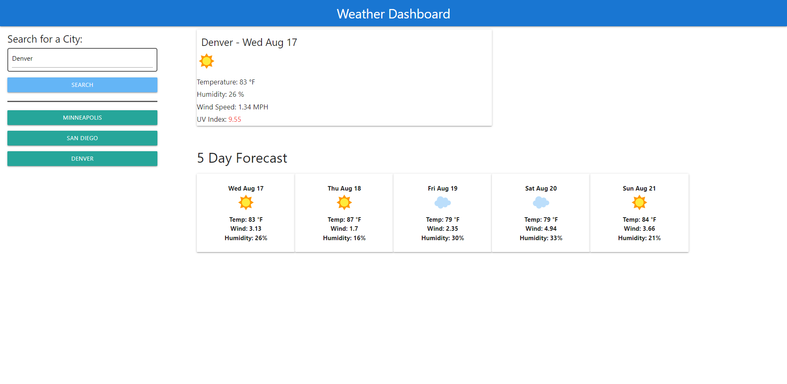

# Weather Dashboard

## Description

Many times it is useful to be able to know what the weather is going to be, but sometimes weather apps and websites are loaded with ads and are hard to navigate.
I've decided to solve this problem by creating a simple website that returns the important data and saves recent searches.

## Table of Contents 

- [Usage](#usage})
- [License](#license)
- [Features](#features)
- [Contributing](#contributing)
- [Tests](#tests)
- [Questions](#questions)

## Usage

To use this app simply visit the deployed version at https://b-alt-del.github.io/Weather-Dashboard/

## License

## Features

-Easy to use interface
-Load todays weather and a simple 5 day forecast
-Saves recent searches to quickly access previous weather data

## Contributing

Feel free to make adjustments on the app and submit a pull request on my github (provided below)    

## Questions

    Feel free to contact with any questions, info below

## Contact Info

